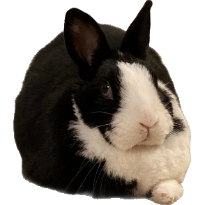
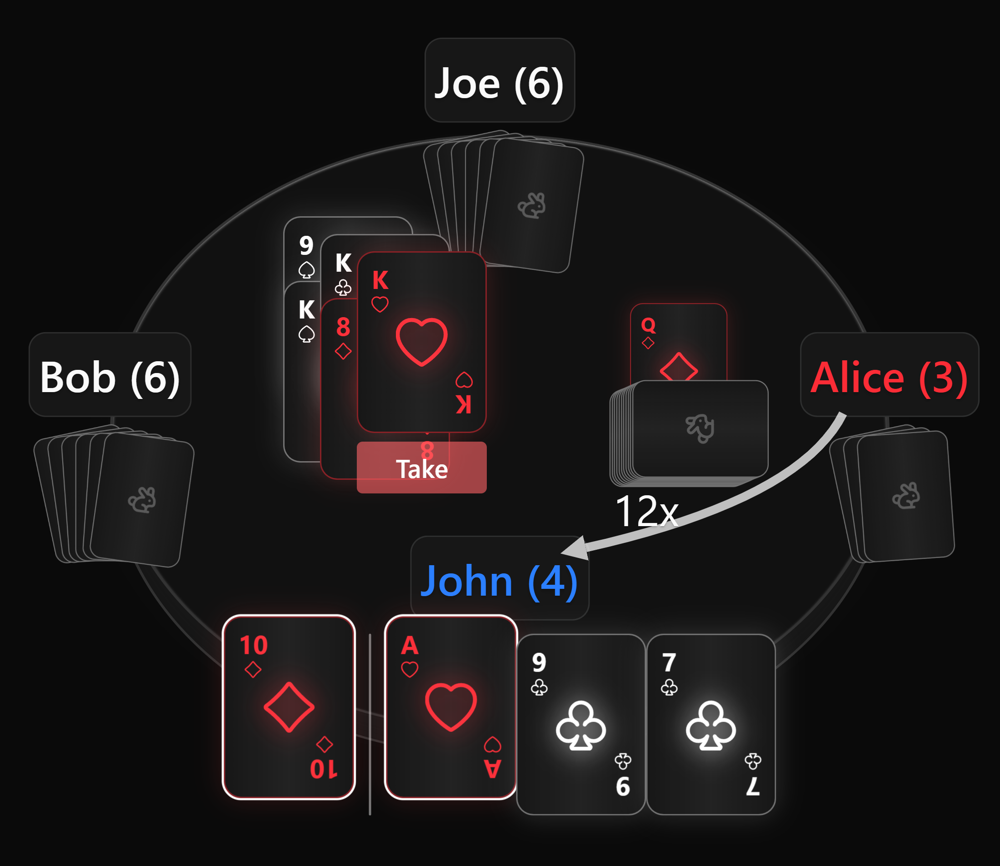
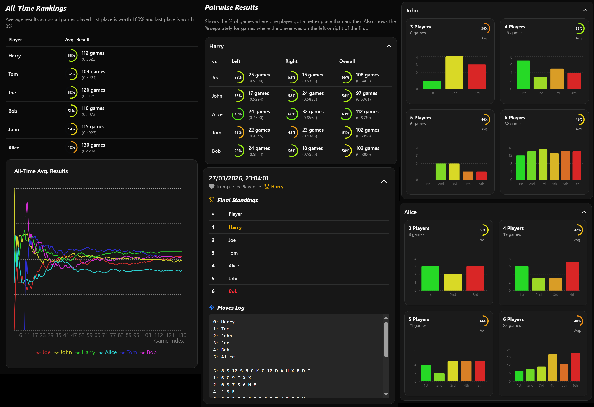

<a id="readme-top"></a>

<br />
<div align="center">
  <a href="https://github.com/KrisPuusepp/SKDurak">
    
  </a>

<h3 align="center">SK Durak</h3>
  <p align="center">
    A modern, online multiplayer Durak game with real-time gameplay and rich aesthetics.
  </p>
</div>

<details>
  <summary>Table of Contents</summary>
  <ol>
    <li>
      <a href="#about-the-project">About The Project</a>
      <ul>
        <li><a href="#features">Features</a></li>
        <li><a href="#built-with">Built With</a></li>
      </ul>
    </li>
    <li><a href="#how-to-play">How to Play</a></li>
    <li>
      <a href="#getting-started">Getting Started</a>
      <ul>
        <li><a href="#prerequisites">Prerequisites</a></li>
        <li><a href="#installation">Installation</a></li>
      </ul>
    </li>
    <li><a href="#privacy--data">Privacy & Data</a></li>
    <li><a href="#license">License</a></li>
  </ol>
</details>

## About The Project

SK Durak is a web-based implementation of the classic Russian card game Durak. Made for online multiplayer with friends and family, it features a modern interface design, customizable cards, and a set of systems for tracking player statistics.

"SK" is the nickname of my pet rabbit. It has nothing got to do with the game itself, but there is an "SK Mode".



### Features

* **Real-time Multiplayer** powered by Socket.io.
* **Sound Effects** for card interactions.
* **Card Customization:** multiple themes, customizable suit shapes, and toggleable visual effects like card glow.
* **Statistics:** Comprehensive tracking of player performance, game history, and session-based leaderboards.
* **Smooth Animations:** Fluid card movements and UI transitions powered by Framer Motion.



<p align="right">(<a href="#readme-top">back to top</a>)</p>

## How to Play

Durak (or "Fool") is a popular Russian card game that can be played with up to 6 players, although 4-5 is the most fun. The goal is to get rid of all your cards. The last player left with cards in their hand is the "Durak".

1. **Setup:** Each player is dealt 6 cards. A "Trump" suit is determined by the card at the bottom of the deck.
2. **Rounds:** Every round has a defender. The player to the defender's right gets to attack first.
3. **Attacking:** The attacker can start an attack with one card of any rank.
3. **Defending:** The defender must beat the card with a higher card of the same suit or any card of the Trump suit. If the attack card is a Trump, the defender must play a higher Trump.
4. **Passing:** An attacker can choose to add more cards to the attack, or pass their turn to the next attacker. You can only play cards with a rank that matches one of the ranks on the table.
5. **Outcome:**
   - If the defender beats all cards from the players to their left and right, the table is cleared and the defender becomes the new attacker.
   - If the defender cannot beat a card, they must pick up all cards on the table and the player to their left becomes the new attacker.
6. **Drawing:** At the end of a round, if there are cards left in the deck, players draw from it until they have at least 6 cards again.

**Note that the rules of SK Durak may slightly differ from the rules that you are used to!** Namely, you cannot:

- play more than one card at a time,
- play cards while it is not your turn, or
- send cards to other players.

Furthermore:

- the seats are shuffled at the start of every game,
- the starting player is always random, and
- only the players to the left and right of the defender get to attack.

<p align="right">(<a href="#readme-top">back to top</a>)</p>

### Built With

* [TypeScript](https://www.typescriptlang.org/)
* [React](https://reactjs.org/)
* [Vite](https://vitejs.dev/)
* [Socket.io](https://socket.io/)
* [Framer Motion](https://www.framer.com/motion/)
* [Howler.js](https://howlerjs.com/)
* [Tailwind CSS](https://tailwindcss.com/)
* [Lucide Icons](https://lucide.dev/)
* [ShadCN/UI](https://ui.shadcn.com/)

<p align="right">(<a href="#readme-top">back to top</a>)</p>

## Getting Started

To run a local copy of the game or host your own server, follow the steps below.

### Prerequisites

SK Durak requires Node.js for both the client and server components. You can download it at <a href="https://nodejs.org/">nodejs.org</a>. Furthermore, port forwarding is required to host online games.

### Installation

1. Clone the repo (or download a .zip from the green "Code" button near the top)
   ```sh
   git clone https://github.com/KrisPuusepp/SKDurak.git
   ```
2. Install NPM packages (with Command Prompt or some other terminal open in the folder)
   ```sh
   npm install
   ```
3. Start a Vite local server (with Command Prompt or some other terminal open in the folder)
   ```sh
   npm run dev
   ```
4. Open `http://localhost:5173/`

If you would like to host a game:

5. Start a Vite server (with Command Prompt or some other terminal open in the folder)
   ```sh
   npm run host
   ```
6. Open `http://localhost:3001/`

If you would like to build the game:

5. Run (with Command Prompt or some other terminal open in the folder)
   ```sh
   npm run build
   ```
   This will build the game into the `dist` folder, as well as generate a `server.cjs` file that can be used by running `node ./server.cjs`. Note that, in this case, the website itself must be served some other way, as `server.cjs` only hosts the game and not the website.

<p align="right">(<a href="#readme-top">back to top</a>)</p>

## Privacy & Data

SK Durak collects and stores certain data to provide game statistics and leaderboard functionality.

* **Data Collected:** Player Name, Alias (optional), game results (wins/losses), and move history.
* **Storage:** Data is stored in JSON files on the server's local file system.
* **Client Storage:** Your Name, Alias, and UI settings are stored in your browser's `localStorage` for convenience.
* **GDPR:** By entering a name and joining a game, you consent to the storage of this information for the purpose of tracking game statistics. Since this is a self-hosted project, **data and consent management are the responsibility of the server host**.

<p align="right">(<a href="#readme-top">back to top</a>)</p>

## License

Distributed under the MIT license. See `LICENSE` for more information.

<p align="right">(<a href="#readme-top">back to top</a>)</p>
